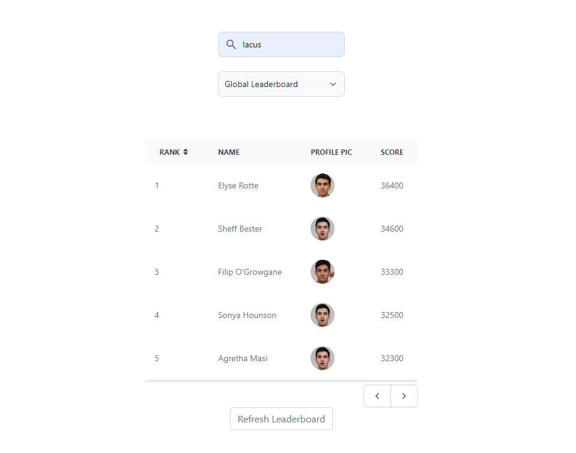

## Development

I have cloned from flowbite-next.js starter project.
[https://github.com/tulupinc/flowbite-next-starter](https://github.com/tulupinc/flowbite-next-starter)

## Project Description

### Overview



### Technologies used:

React/Next.js/tailwindcss/Flowbite

### Structure

#### constants

Constant values are defined in `constants/index.ts`

```
export const REFRESHING_TIME = 500 // ms
export const BACKEND_API = 'http://localhost:8080/api'
```

#### API
APIs are defined in `api/index.ts`.

I have made it with javascript fetch function without using any libraires.

#### React hooks

I have used React `useContext` hook and a custom hook (`useAsync`) to manage the leaderboard data.
` // pages/_app.tsx <LeaderboardContext.Provider value={{ fetchData, data, setData, status, error }}> {children} </LeaderboardContext.Provider> `

    ```
    // a hook to manage async state from api
    function useAsync<D, E, F>() {
      const [state, unSafeDispatch] = useReducer(asyncReducer, {
        status: 'idle',
        data: null,
        error: null,
      } as AsyncState<D, E>)
    ```

#### view

The main component to show leaderboard data is `components/LeaderboardTable.tsx`.
It is getting data and methods from `LeaderboardContext`.

```
const { data, status, error, fetchData, setData } = useLeaderboardContext()
```

And it is displaying leaderboard data with tailwindcss table.
It allows pagination if the range is `Global Leaderboard` and will display 100 gamers if the range is `Top 100`
I have used useMemo and useCallback hooks to prevent rerendering issues of react.
If user clicks the refresh button, it will be changed to 'refreshing' and will be disabled for 0.5 sec to prevent too many requests to the server. In addition, backend has `express-rate-limit` module installed, so if user sends 100+ requests per a minute, it will responds with `429 (too many requests)` error
